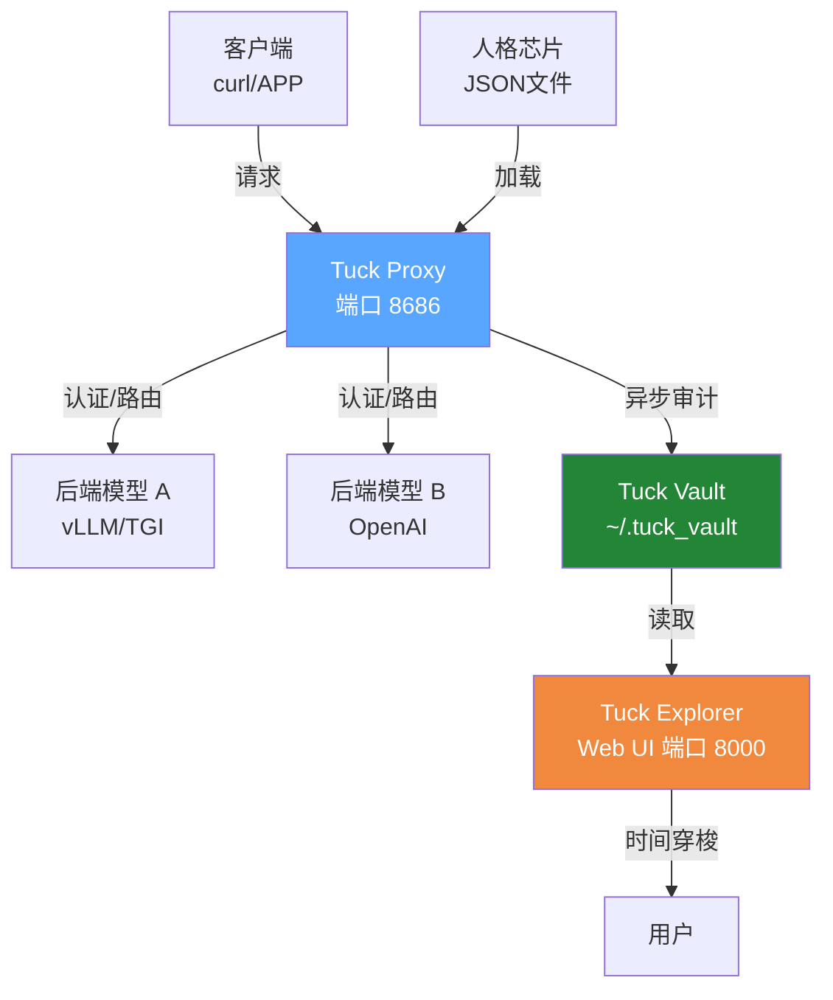

# 🕰️ Tuck – AI会话审计与版本控制系统

<p align="center">
  
  
  
  
  
</p>

Tuck 是一个为 AI 交互设计的**轻量级、不可变审计层**。它作为反向代理嵌入你的模型服务前端，自动记录每一次会话，并提供类似 Git 的内容寻址存储和 Web 时间机器。无需数据库，仅依赖文件系统，极致安全，零信任就绪。

---

## ✨ 特性

- **🔐 极致安全**  
  - 内容寻址存储，防篡改  
  - 原子写入 + 跨进程文件锁  
  - 路径遍历防御、Unicode 规范化  
  - 可选 Bearer 认证，支持 API 密钥隔离  

- **⚡ 极致高效**  
  - 异步非阻塞代理（FastAPI + HTTPX）  
  - 流式转发，零拷贝内存  
  - Persona 文件缓存（基于 mtime）  
  - 连接池复用，支撑高并发  

- **💤 极致节能**  
  - 无后台进程，按需扫描  
  - 轻量级文件存储，无额外依赖  
  - 智能轮询间隔，避免空转  

- **🧠 人格芯片注入（彩蛋级功能）**  
  - 通过 HTTP 头 `X-Tuck-Persona` 动态加载系统提示和参数  
  - 支持 JSON 格式人格库，安全隔离  
  - **AI 时代，你可以用 Tuck 开一家属于自己的 AI 公司！**

- **📜 完整审计能力**  
  - 每条会话生成不可变 Commit ID（SHA256）  
  - 记录父级引用，形成版本链  
  - CLI 工具和 Web UI 双重视角浏览历史  
  - **⏳ 时间穿梭：一键回到任意历史版本**

---

## 🧱 架构概览



---

## 🚀 快速开始

### 1. 安装

```bash
# 克隆项目
git clone https://github.com/Jasonmilk/Tuck.git
cd Tuck

# 安装依赖
pip install -r requirements.txt

# 全局安装（推荐）
pip install .
```

### 2. 启动代理（生产级命令）

```bash
# 设置环境变量（可选，也可以用 .env 文件）
export TUCK_API_KEY="sk-您的密钥"
export TUCK_BACKENDS="8016,8020"  # 本地模型端口，或完整URL

# 启动代理服务（生产级配置）
uvicorn tuck.proxy:app \
  --host 0.0.0.0 \
  --port 8686 \
  --interface asgi3 \
  --proxy-headers \
  --workers 4
```

### 3. 发送请求

```bash
curl http://localhost:8686/v1/chat/completions \
  -H "Authorization: Bearer sk-您的密钥" \
  -H "X-Tuck-Persona: coder" \
  -d '{
    "model": "llama3-8b",
    "messages": [{"role": "user", "content": "你好"}]
  }'
```

### 4. 查看审计记录

```bash
# CLI 查看最近 20 条提交
tuck -l 20

# 启动 Web UI 时间机（生产级配置）
uvicorn tuck.explorer:app \
  --host 0.0.0.0 \
  --port 8000 \
  --interface asgi3 \
  --proxy-headers
# 浏览器访问 http://localhost:8000，输入 API 密钥登录
```

---

## ⚙️ 配置说明

所有配置通过环境变量或 `.env` 文件设置。

| 变量名                         | 说明                                      | 默认值                |
|-------------------------------|-------------------------------------------|----------------------|
| `TUCK_API_KEY`                | API 密钥（空则禁用认证，生产环境必须设置）  | `""`                 |
| `TUCK_BACKENDS`               | 逗号分隔的后端地址（端口或完整 URL）       | `"8016"`             |
| `TUCK_PERSONAS_DIR`           | 人格 JSON 文件目录                         | `"personas"`         |
| `TUCK_VAULT_DIR`              | 审计数据存储目录                           | `"~/.tuck_vault"`    |
| `TUCK_SCAN_INTERVAL`          | 后端模型发现间隔（秒）                      | `60`                 |
| `TUCK_MAX_CONNECTIONS`        | 最大并发连接数                             | `500`                |
| `TUCK_FORWARD_TIMEOUT`        | 转发请求超时（秒）                          | `120`                |
| `TUCK_MAX_REQUEST_SIZE`       | 最大请求体大小（字节）                      | `10485760` (10MB)    |
| `TUCK_PROBE_CONCURRENCY`      | 并发探测后端数                              | `10`                 |
| `TUCK_PERSONA_CACHE_SIZE`     | 人格文件缓存数量                            | `128`                |

---

## 📖 使用指南

### 人格芯片（Persona）- 开一家 AI 公司

在 `personas/` 目录下放置 JSON 文件，例如 `coder.json`：

```json
{
  "system_prompt": "你是一个资深软件工程师，回答简洁专业。",
  "params": {
    "temperature": 0.3,
    "max_tokens": 2048
  }
}
```

你可以创建多个角色：
- `assistant.json` → 你的客服助理
- `consultant.json` → 你的专业顾问
- `teacher.json` → 你的私教老师
- `writer.json` → 你的文案写手

请求时携带 `X-Tuck-Persona: coder` 头即可自动注入。

### 审计 CLI

```bash
# 显示最近 20 条提交（默认）
tuck -l 20

# JSON 格式输出，偏移 10 条
tuck -l 5 -o 10 --json

# 指定不同 vault 目录
tuck --vault /data/tuck_vault
```

### Web UI 时间机器

访问 `http://<explorer-host>:8000`，使用 `X-Tuck-Key` 头（或登录页面输入）认证。界面左侧是提交时间线，右侧显示完整对话详情，支持复制 Commit ID，**点一下即可时间穿梭回到过去**。

---

## 🛡️ 安全注意事项

1. **必须启用 HTTPS**  
   生产环境务必在反向代理层（如 Nginx）配置 TLS，防止密钥和对话内容明文传输。

2. **API 密钥管理**  
   - 定期轮换密钥。  
   - 不要将密钥提交到代码仓库。  
   - 使用环境变量或密钥管理服务注入。

3. **网络隔离**  
   - Tuck Explorer 应仅在内网或 VPN 内访问。  
   - 代理服务可对外暴露，但需配合速率限制（如 `nginx limit_req`）。

4. **文件权限**  
   Tuck 自动设置 vault 目录权限为 `700`，确保运行用户独立。

5. **定期备份**  
   `~/.tuck_vault` 包含所有审计数据，建议使用 `cron` 备份到异地存储。

---

## 📊 性能与规模

- **单节点吞吐**：约 200 QPS（取决于后端模型延迟），瓶颈在磁盘 I/O。  
- **存储估算**：每条提交平均 2KB，百万提交约 2GB 空间。  
- **审计延迟**：提交在请求后异步写入，不影响主流程（<5ms 额外开销）。  
- **并发限制**：文件锁保证同一 vault 串行写入，适合日提交量 ≤ 10 万的中小团队。若需更高规模，可考虑分片或多实例独立 vault。

---

## 🏭 生产级部署建议

### Nginx 反向代理配置示例
```nginx
# Tuck Proxy (api.tuck.com)
server {
    listen 443 ssl http2;
    server_name api.tuck.com;

    ssl_certificate /etc/letsencrypt/live/api.tuck.com/fullchain.pem;
    ssl_certificate_key /etc/letsencrypt/live/api.tuck.com/privkey.pem;

    location / {
        proxy_pass http://127.0.0.1:8686;
        proxy_set_header Host $host;
        proxy_set_header X-Real-IP $remote_addr;
        proxy_set_header X-Forwarded-For $proxy_add_x_forwarded_for;
        proxy_set_header X-Forwarded-Proto $scheme;
        proxy_buffering off;
        proxy_request_buffering off;
        proxy_http_version 1.1;
    }
}

# Tuck Explorer (cli.tuck.com)
server {
    listen 443 ssl http2;
    server_name cli.tuck.com;

    ssl_certificate /etc/letsencrypt/live/cli.tuck.com/fullchain.pem;
    ssl_certificate_key /etc/letsencrypt/live/cli.tuck.com/privkey.pem;

    # 建议添加 IP 白名单或 Basic Auth
    allow 192.168.1.0/24;
    deny all;

    location / {
        proxy_pass http://127.0.0.1:8000;
        proxy_set_header Host $host;
        proxy_set_header X-Real-IP $remote_addr;
        proxy_set_header X-Forwarded-For $proxy_add_x_forwarded_for;
        proxy_set_header X-Forwarded-Proto $scheme;
    }
}
```

### Systemd 服务配置示例
创建 `/etc/systemd/system/tuck-proxy.service`：
```ini
[Unit]
Description=Tuck AI Proxy
After=network.target

[Service]
Type=notify
User=tuck
WorkingDirectory=/opt/Tuck
Environment="TUCK_API_KEY=sk-your-secure-key"
Environment="TUCK_BACKENDS=8016,8020"
ExecStart=/usr/local/bin/uvicorn tuck.proxy:app --host 127.0.0.1 --port 8686 --interface asgi3 --proxy-headers --workers 4
Restart=always

[Install]
WantedBy=multi-user.target
```

---

## 🤝 贡献指南

欢迎报告问题或提交 PR！  
主要维护方向：  
- 增加 S3 兼容存储后端  
- 支持更多模型提供商（如 Anthropic）  
- 性能优化（索引、批处理）

---

## 📄 许可证

MIT © 2026 Tuck Contributors

---

**Tuck – 让每一次 AI 对话都留下不可磨灭的印记。**  
[报告问题](https://github.com/Jasonmilk/Tuck/issues) | [讨论](https://github.com/Jasonmilk/Tuck/discussions)

---

## 💡 彩蛋
> **AI 时代，每个人都可以用 Tuck 开一家属于自己的 AI 公司。**  
> 你不需要懂技术，只需要：
> 1. 准备几个不同的人格芯片（Personas）
> 2. 启动 Tuck 网关
> 3. 把你的 API 给用户
>
> 剩下的，Tuck 帮你搞定。

**Star 本项目，开启你的 AI 时间旅行！** 🚀
