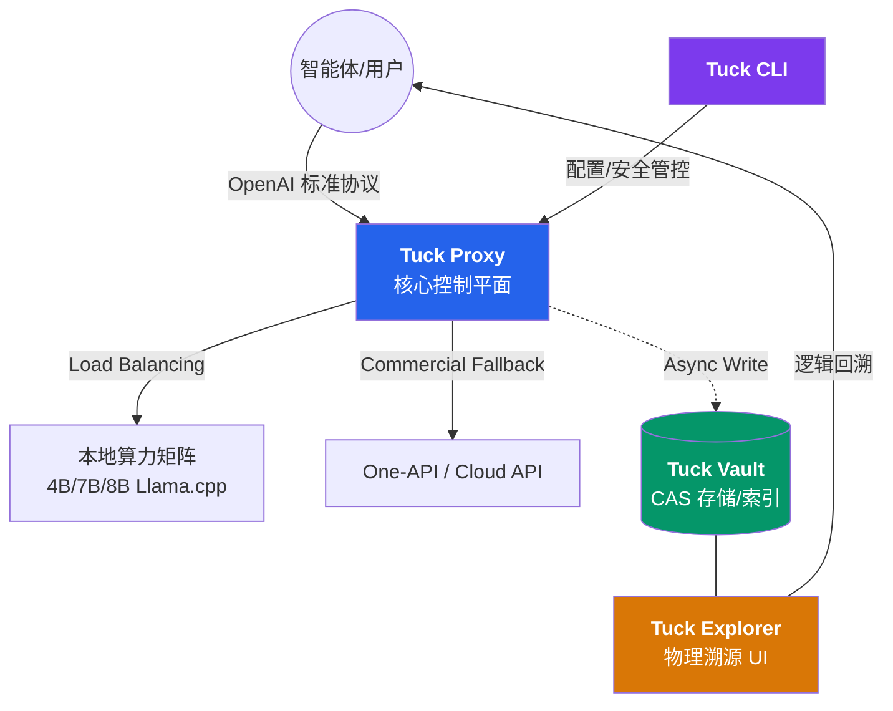

# 🕰️ Tuck: The Immutable Audit & Versioning Layer for AI Conversations

<p align="center">
  <b>面向大规模语言模型的分布式审计网关 | 内容寻址存储 | 异构算力路由</b>
</p>

<p align="center">
  
  
  
  
  
</p>

---

## 🔬 1. 项目定义 (Definition)

Tuck 是一套为生成式 AI（Generative AI）设计的**不可变审计与版本控制抽象层**。在学术与工业研发流程中，LLM 的输出具有随机性与上下文依赖性，Tuck 通过物理级的拦截与持久化，将每一轮非结构化的对话碎片转化为可索引、可溯源的**有向无环图（DAG）**结构。

其设计哲学借鉴了 Git 的内容寻址逻辑，旨在解决复杂智能体（Agent）系统中“逻辑断层”与“幻觉溯源”的痛点。

---

## 核心技术特性 (Core Features)

*   **💾 内容寻址存储 (CAS)**：基于 SHA256 算法的不可变存储架构。系统自动识别重复的 Prompt 与 Response 片段，物理层面仅保留唯一副本，实现海量会话数据的极致去重。
*   **⏳ 状态回溯与分支 (State Tracking)**：通过 Web UI 视觉化复现会话时空。支持点击任意节点重建完整的上下文链路，实现“对话级的断点调试”。
*   **🧠 协议驱动的人格芯片 (Persona Injection)**：通过 `X-Tuck-Persona` 头部协议实现系统级提示词（System Prompt）与超参数（Top-P/Temperature）的物理隔离与动态注入。
*   **📡 高延迟弹性架构 (Latency Resilience)**：针对 DeepSeek-R1 等长序列推理模型进行优化，内置 600s 级深度隧道与 KV 缓存接力机制，有效对抗 ARM 节点预填充阶段的网关超时。
*   **🎭 企业级隐私屏障 (Cyber Camouflage)**：**[实验性功能]** 针对第三方商用 API 链路提供语义混淆（Obfuscation）支持。通过动态映射表实现私有实体的脱敏转换，有效降低意图坍缩风险并保护商业隐私。
*   **🔗 异构网关路由**：内置商用 API 冗余开关，支持在本地私有化模型矩阵与公有云 API 之间进行无缝流量调度。

---

## 🏗️ 3. 系统架构 (Architecture)



---

## 🚀 4. 部署指南 (Deployment)

### 4.1 安装环境

```bash
git clone https://github.com/Jasonmilk/Tuck.git
cd Tuck
pip install -e .
```

### 4.2 物理链路初始化 (CLI)

Tuck 提供全交互式的管理终端。直接运行 `tuck` 即可进入管理模式：

```bash
tuck
```
*在此菜单中，建议首选执行 `Option 2` 进行 Web UI 访问权限加密。*

### 4.3 环境变量对齐 (`.env`)

| 变量 | 说明 | 推荐值 |
| :--- | :--- | :--- |
| `TUCK_BACKENDS` | 后端模型端口集群 | `8014,8015,8016` |
| `TUCK_FORWARD_TIMEOUT` | 全局响应超时(秒) | `600.0` |
| `TUCK_ENABLE_ONEAPI` | 商用通道总开关 | `false` |
| `TUCK_OBFUSCATE_MODE` | 语义混淆模式 | `commercial` |

---

## 💡 5. 核心交互规范 (Usage)

### 🧩 人格芯片调用
在 `personas/` 下部署 `architect.json`，请求时携带以下 Header：
```http
X-Tuck-Persona: architect
```

### 🌉 商用冗余介入
当本地算力饱和或执行高精度任务时，可开启商用超车道：
```http
X-Tuck-Commercial: true
```

---

## 🛡️ 6. 安全与审计原则

1.  **零数据库依赖**：Tuck 采用纯文件锁机制，不引入额外的数据库组件，确保数据在物理层面的绝对独立。
2.  **权限最小化**：Vault 目录默认采用 `0700` 权限，仅允许 Tuck 运行账户访问。
3.  **每日迷彩轮换**：建议通过 `cron` 定期更新 `rules/obfuscation.json` 映射表，以获得最高等级的语义安全。

---

## 📄 许可证

本项目采用 [MIT License](LICENSE) 许可。

---

<p align="center">
  <b>Tuck - 记录硅基生命的每一次演进轨迹。</b><br/>
  Research by Jasonmilk
</p>
